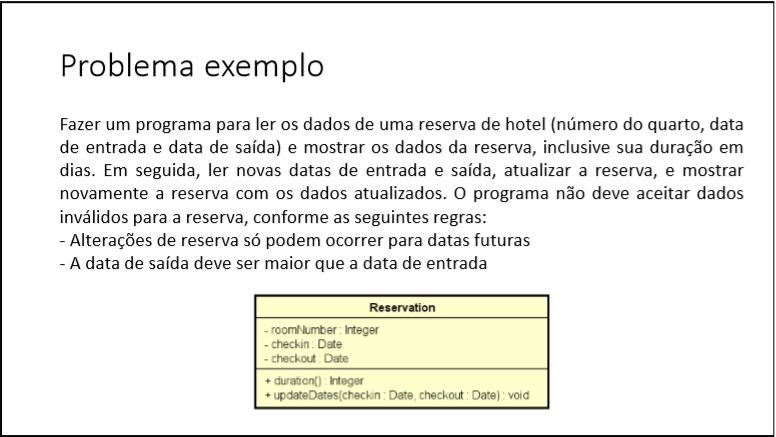
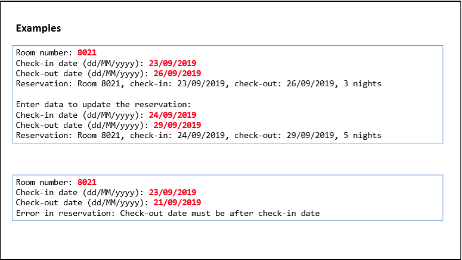
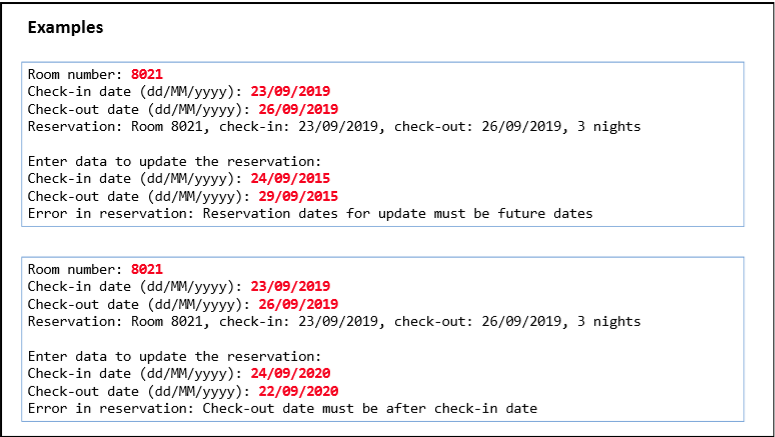

# Exceptions
Aplicação básica, feita em java, com a finalidade de estudo do conceito de tratamento de exceções.  
 

Ao iniciar o programa em qualquer IDE, o programa se comportará da seguinte maneira: 

<ul>
  <li> <b>Em vermelho:</b> entrada do usuário </li>
</ul>
 
  
 
